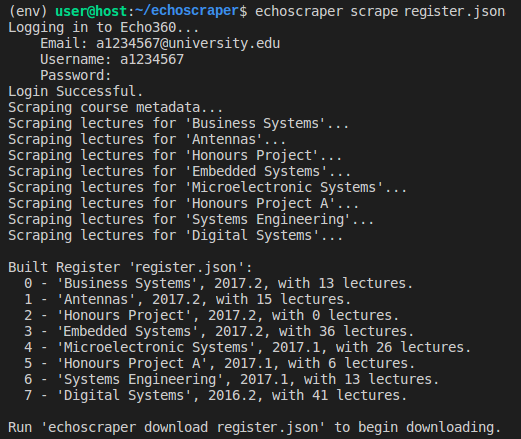

=============
Echoscraper
=============

Echoscraper is used to automatically download and categorize lectures from Echo360.org. State is maintained between runs through the use of a register file which keeps track of what files have been downloaded, and contains the metadata required to uniquely identify each file, on disk and online.

.. image:: /doc/downloader.png
    :alt: Example of echoscraper downloading.
    :width: 100%
    :align: center

Test-run
--------

If you just want to run the package files without going through the hassle of installing it, then you can run all commands through the echoscraper-runner.py wrapper module.
However, you will have to manually install the following dependencies:

- lxml==4.1.1
- requests==2.18.4
- clint==0.5.1

The version numbers are the latest versions of each package that have been confirmed to work, however it is likely that later versions will work just as well.

Alternatively, you may like to install the full package, in which case setuptools will download all dependencies automatically.

Installation
------------

This section attempts to describe a step-by-step method for installing this package. (tbh I hate Python's package management/installation crap so YMMV for this)
Once installed, your project directory *should* look something like this:

LectureDownloader

└── echoscraper

│    ├── build

│    ├── dist

│    ├── echoscraper

│    │   ├── data.py

│    │   ├── download.py

│    │   ├── echo360login.py

│    │   ├── echoscraper.py

│    │   ├── __init__.py

│    │   ├── __main__.py

│    │   ├── register.py

│    │   └── scraper.py

│    ├── echoscraper.egg-info

│    ├── echoscraper-runner.py

│    ├── README.rst

│    ├── setup.py

(The register file and folder containing your lecture downloads should go here once you start running the echoscraper program)

│    *├── Register.json*

│    *└── lectures*

└── env

**Instructions:**

#. Create a folder to store files e.g. 'LectureDownloader' 
#. Copy the 'echoscraper' package into this 'LectureDownloader' folder
#. Open 'LectureDownloader' in a terminal window
#. Create a virtual environment called 'env' that uses python 3 (install virtualenv if you don't have it already):

    virtualenv -p python3 env

#. Activate the virtual environment:

    source env/bin/activate

#. Change directory into the 'echoscraper' root folder:

    cd echoscraper

#. Install the 'echoscraper' package:

    python setup.py install

#. Change directory back to the 'LectureDownloader' directory

    cd ..

If all went well, echoscraper should now be installed in this virtual environment. Try running 'echoscraper' while in the activated environment and you should be greeted by the usage information for the package.

Continue reading the how-to section for information on how to use echoscraper to download your lectures.

How-To
--------
Choose a name for your register 
 e.g. 'register.json'

1. Build the register file by running:

                echoscraper scrape register.json

2. (optional) Check how many lectures you have to download in your register:

                echoscraper register register.json

3. Begin downloading all files in the register by running:

                echoscraper download register.json

Commands
--------

echoscraper can be run with three possible commands:

- *scrape <filename>*
- *register [options] <filename>*
- *download [options] <filename>*

All commands require one argument, the register filename.

scrape
~~~~~~~

Logs onto Echo360.org and scrapes all course and lecture metadata. Most importantly, it scrapes a download link, which is used when calling 'download', to download a particular lecture video file. Scrape can be called multiple times and it will not overwrite previously scraped data. This is useful for updating the register after a new lecture or course has been released.

Scrape has no extra options.

register
~~~~~~~~

Gives general information about the register to the user. There are several options for accessing different amounts of information.

When run with no options it simply counts the number of courses left to download out of the total number.

The below options are mutually-exclusive, meaning if multiple options are passed, only one will be executed. They are listed below in the order of highest priority to lowest. Generally, the options with less to print are prioritised over more verbose options.

*Options:*

-d          prints the [d]ocket, a list of the all the courses on file
-m          prints docket plus any [m]issing lectures
-f          prints [f]ull list of courses and all lectures, regardless of whether they are missing or not

download
~~~~~~~~

Downloads any lectures listed in the register which don't have a valid filename field. If the filename field for a given lecture is empty, then the file hasn't been downloaded yet as far as echoscraper is concerned.

**NOTE:** echoscraper doesn't compare its register with the contents of the ./lectures folder once a video file has been downloaded. This means you can move video files from this folder to other storage locations without messing with the program state, however this also means once a file has been downloaded, it can't be re-downloaded without manually editing the filename field in the register. If you wish to do this for whatever reason, the filename should be set to an empty string ''.

Download generally runs continuously once started, until all lectures are downloaded. **The download loop can be halted by pressing ctrl + C (^C) once**. This signals the program to terminate when the current download finishes. **If pressed a second-time** the program will terminate immediately, however **download progress on the current file will be lost**.

*Options:*

-y          Automatically selects [y]es to begin downloading without prompting after login
-c          Allows the user to [c]hoose what courses to download. Enter the numbers corresponding to the courses you wish to download one at a time. When done, hit enter again to continue. The program will run and download only lectures from the chosen courses.